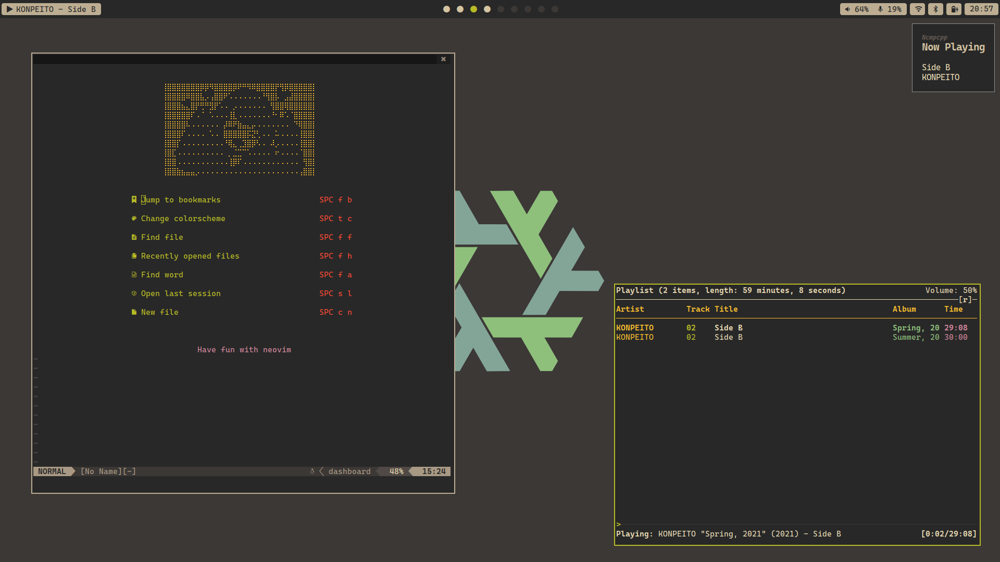

# nixos-config

Welcome to my personal NixOS configuration ft. [home-manager][hm] and [flakes](https://nixos.wiki/wiki/Flakes)! 😄

First sorry about my English, I'm learning that language and I've some difficulties, feel free to open a PR if you find some typo.

- [nixos-config](#nixos-config)
  - [Details](#details)
  - [Installation](#installation)

## Details



|                     |                                                                                                                      |
| ------------------- | -------------------------------------------------------------------------------------------------------------------- |
| OS                  | [NixOS](https://nixos.org/)                                                                                          |
| Shell               | [Fish](https://fishshell.com/)                                                                                       |
| Terminal Emulator   | [Foot](https://codeberg.org/dnkl/foot)                                                                               |
| Font                | [Cascadia Code](https://github.com/microsoft/cascadia-code)                                                          |
| Window Manager      | [River](https://github.com/riverwm/river) + [kile](https://gitlab.com/snakedye/kile)                                 |
| Status Bar          | [Waybar](https://github.com/Alexays/Waybar)                                                                          |
| Launcher            | [Bemenu](https://github.com/Cloudef/bemenu)                                                                          |
| Notification Daemon | [Fnott](https://codeberg.org/dnkl/fnott)                                                                             |
| GTK Theme           | [Gruvbox Dark](https://github.com/jmattheis/gruvbox-dark-gtk)                                                        |
| Browser             | [Firefox](https://github.com/emersion/mako), [Amfora](https://github.com/makeworld-the-better-one/amfora)            |
| Text Editor         | [Neovim](https://neovim.io/), [Emacs](https://www.gnu.org/software/emacs/), [VSCode](https://code.visualstudio.com/) |

## Installation

First, generate the configuration, you need the `hardware-configuration.nix` file, which have your mount configuration.

```
nixos-generate-config --root /mnt
```

Now you can clone the repository, copy the `hardware-configuration.nix` file and build the system

```
nix-shell -p nixUnstable git
git clone https://codeberg.org/imMaturana/nixos-config.git /mnt/flake

# copy the hardware configuration
cp /mnt/etc/nixos/hardware-configuration.nix /mnt/flake/hosts/beepboop/

# now you can build the system
nixos-install --flake /mnt/flake#beepboop --root /mnt
```

That's it! 🥳

<!-- some links with id -->
[hm]: https://github.com/nix-community/home-manager
